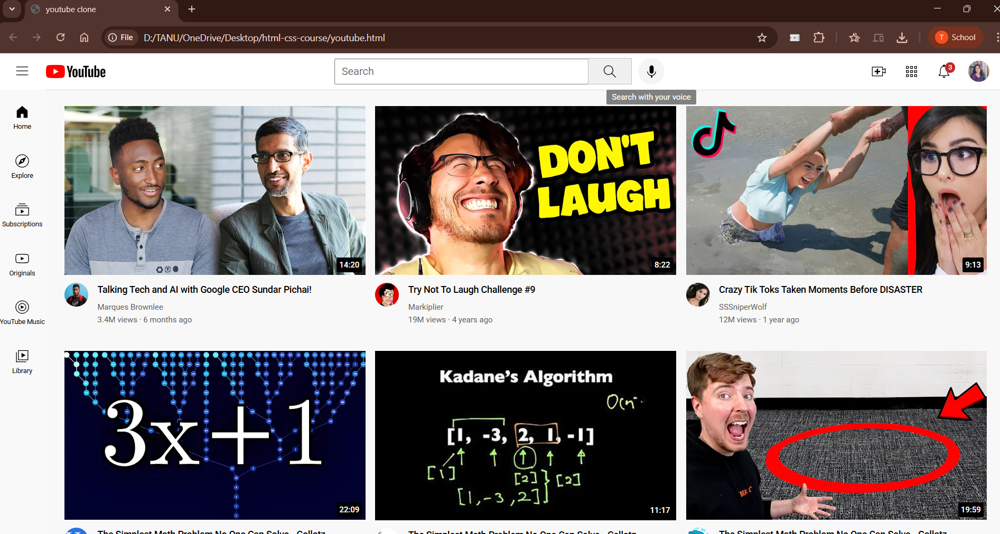
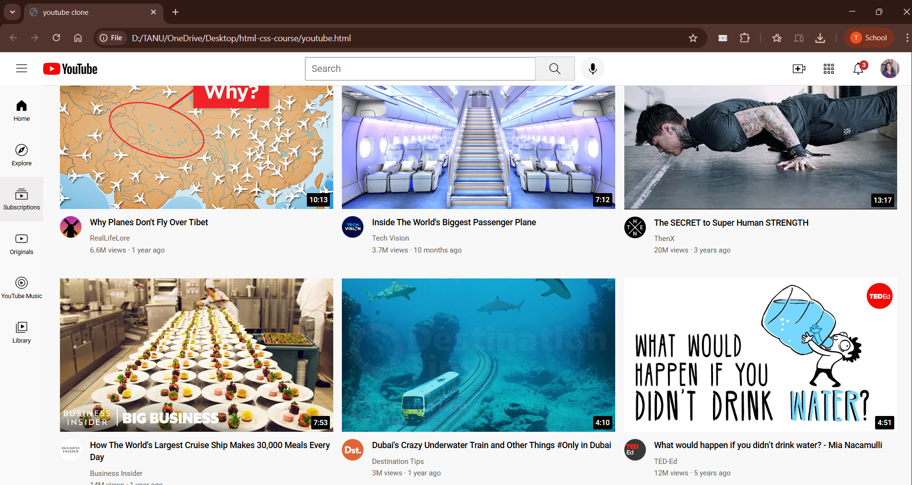

# 🎬 YouTube Clone
A frontend-focused **YouTube homepage clone** built to practice clean UI layout, responsiveness, and modern HTML/CSS styling. This project was created as part of my learning journey to better understand how real-world websites structure content and design reusable components.

---

## ✨ About the Project
This YouTube clone replicates the **visual layout and user interface** of YouTube’s homepage.  
The goal was not to recreate full functionality, but to focus on:

- Page structure  
- Layout systems (Flexbox & Grid)  
- Visual consistency  
- Responsive design principles  

I built this project while learning frontend development through tutorials and hands-on practice.

---

## 🎓 Learning Source & Credit
This project was built by following and learning from **SuperSimpleDev**’s frontend tutorials on YouTube.  
The tutorial helped me understand how to break down complex layouts and apply HTML & CSS concepts effectively.
All implementation was done by me as part of my learning process.

---

## 🖼️ Screenshots
<p align="center">
  
</p>

<p align="center">
  
</p>

<p align="center"><i>Homepage layout and video grid design</i></p>

---

## 🛠️ Tech Stack
- **HTML5** – Semantic structure  
- **CSS3** – Styling, layouts, responsiveness  
- **Flexbox & Grid** – Page alignment and content layout  

---

## 📌 Features
- Responsive video grid layout  
- Video thumbnail cards with duration labels  
- Channel information section  
- Sidebar-style layout structure  
- Clean and consistent UI styling  

---

## 🚧 Limitations
This is a **frontend-only project**.
- No backend  
- No authentication  
- No real video playback  
- No API integration  

These features may be explored in future iterations.

---

## 🌱 What I Learned
- Structuring complex layouts using HTML  
- Using CSS Grid for responsive designs  
- Improving UI spacing and alignment  
- Writing cleaner and more readable CSS  

---

## 🚀 Future Improvements
- Add JavaScript for interactivity  
- Improve mobile responsiveness  
- Explore YouTube Data API (for learning purposes)  
- Refactor code for better scalability  

---

## 📂 How to Run Locally
1. Clone the repository  
   ```bash
   git clone https://github.com/your-username/youtube-clone.git
2. open youtube.html in your browser

---

## Note :
This project is built purely for educational purposes.
All design inspiration belongs to YouTube.